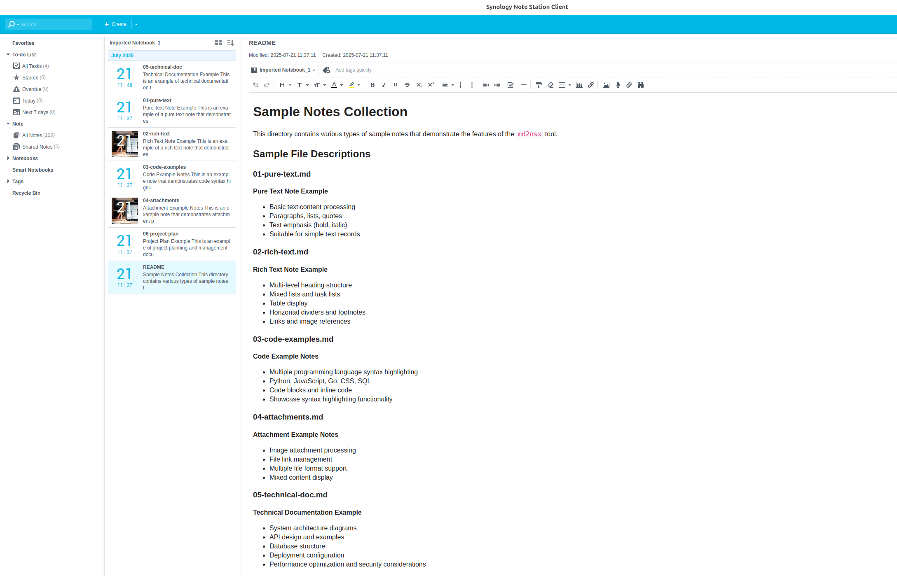
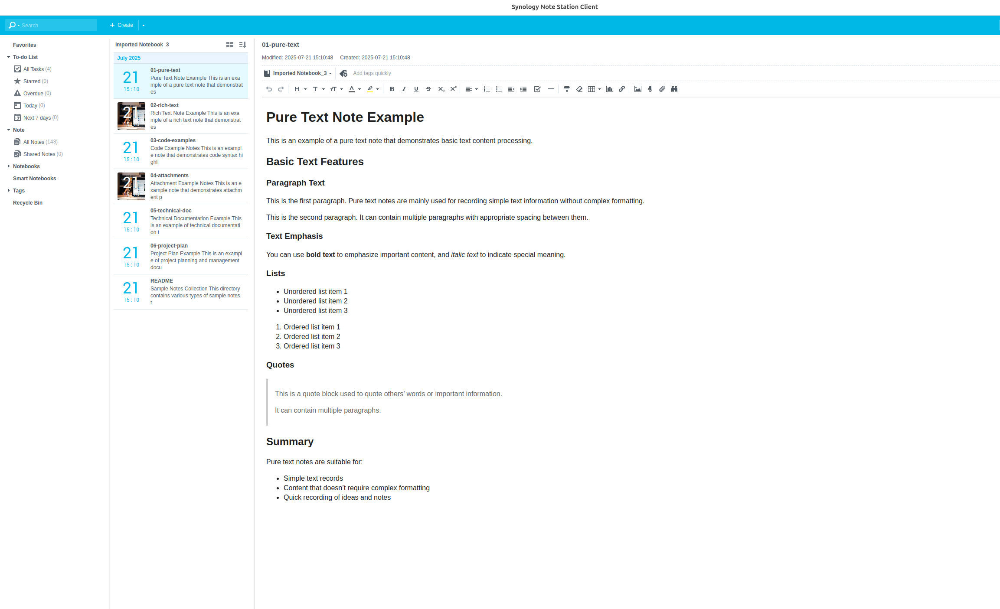
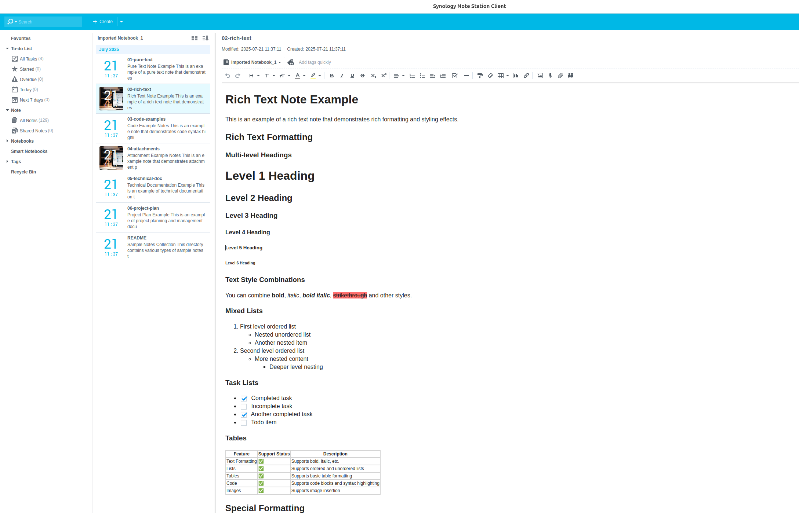
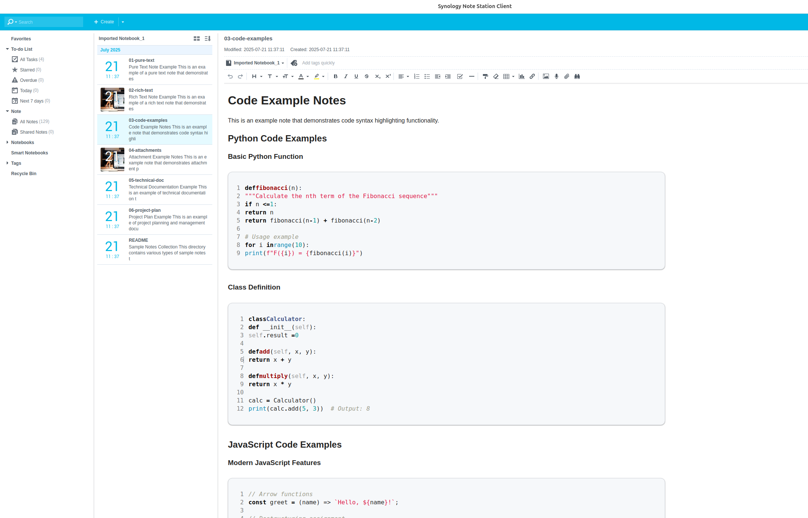
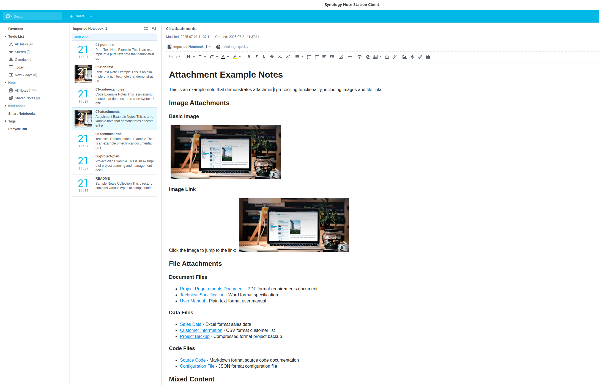
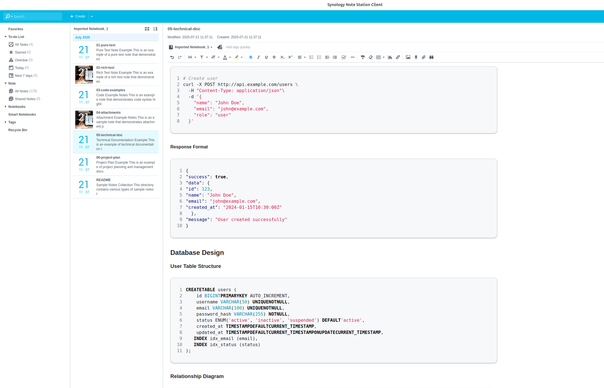
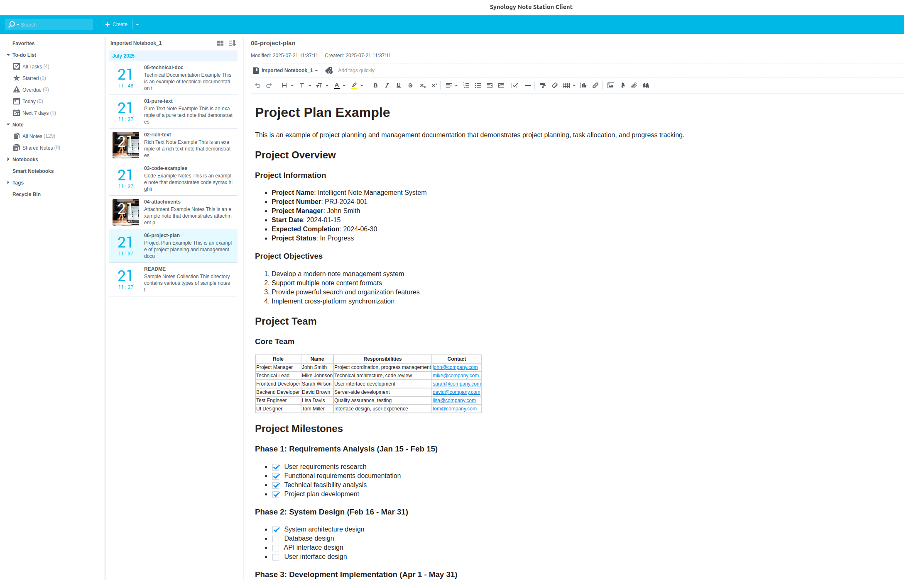

# md2nsx

A high-performance Go implementation for converting Markdown files to Synology Note Station (NSX) format with comprehensive feature support and optimized performance.

## ✨ Key Features

- **🔄 Batch Conversion**: Convert multiple Markdown files to NSX format in one command
- **📎 Rich Attachment Support**: Images, documents, archives, and code files with automatic MIME detection
- **🌈 Advanced Syntax Highlighting**: Support for programming languages with GitHub-style colors
- **📝 Complete Markdown Support**: Headers, lists, tables, code blocks, footnotes, task lists, and more
- **🎨 Enhanced Styling**: Beautiful inline CSS styling for optimal Note Station compatibility
- **⚡ Performance Optimized**: Pre-compiled regex patterns and efficient processing
- **🌍 Internationalization**: Full English documentation and sample files
- **🔧 Cross-platform**: Works on Linux, Windows, and macOS

## 📦 Installation

### Prerequisites

### Method 1: Go Install (Recommended)

```bash
go install github.com/clark-ioe/md2nsx@latest
```

This will install the binary to `$GOPATH/bin/md2nsx`. Make sure `$GOPATH/bin` is in your PATH.

### Method 2: Download from GitHub Releases

1. Visit [GitHub Releases](https://github.com/clark-ioe/md2nsx/releases)
2. Download the appropriate binary for your platform:
   - `md2nsx-darwin-amd64` for macOS
   - `md2nsx-linux-amd64` for Linux
   - `md2nsx-windows-amd64.exe` for Windows
3. Make it executable (Linux/macOS): `chmod +x md2nsx-darwin-amd64`
4. Move to a directory in your PATH or use directly

### Method 3: Build from Source

```bash
# Clone the repository
git clone https://github.com/clark-ioe/md2nsx.git
cd md2nsx

# Install dependencies and build
go mod tidy
go build -o md2nsx

# Or use the provided Makefile
make build
```


## 🎯 Usage

```bash
./md2nsx [options] <markdown_folder>
```

### Options

- `-n, --notebook <name>`: Set custom notebook name (default: "Imported Notebook")

### Examples

```bash
# Convert markdown files with default notebook name
./md2nsx ./my-notes

# Convert with custom notebook name (flags must come BEFORE folder argument)
./md2nsx --notebook "Project Notes" ./my-notes

# Convert with short flag
./md2nsx -n "Project Notes" ./my-notes

# Convert with long flag
./md2nsx --notebook "Project Notes" ./my-notes

# [X] WRONG: Flags after folder argument will not work
./md2nsx ./my-notes --notebook "Project Notes"  # This won't work!
```

### Important: Parameter Order

**Flags must be specified BEFORE the folder argument:**

```bash
# [OK] Correct
./md2nsx --notebook "Name" ./folder
./md2nsx -n "Name" ./folder

# [X] Incorrect  
./md2nsx ./folder --notebook "Name"
./md2nsx ./folder -n "Name"
```

## 🎨 Preview

Here are some examples of how the converted notes look in Synology Note Station:















## 🤝 Contributing

Contributions are welcome! Please feel free to submit a Pull Request.
