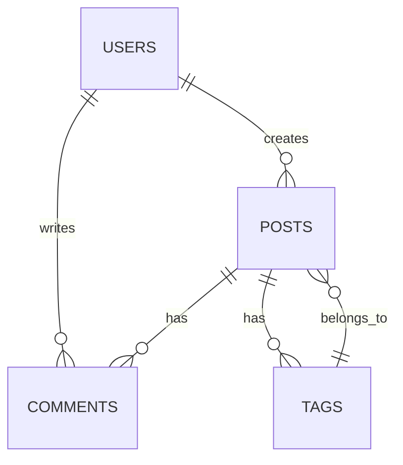

# Technical Documentation Example

This is an example of technical documentation that demonstrates the ability to handle complex technical content.

## System Architecture

### Overall Architecture Diagram
```
┌─────────────────┐    ┌─────────────────┐    ┌─────────────────┐
│  Frontend Layer │    │ Business Logic  │    │ Data Access     │
│                 │    │     Layer       │    │     Layer       │
│                 │    │                 │    │                 │
│ - Web Interface │◄──►│ - Service Layer │◄──►│ - Data Models   │
│ - Mobile App    │    │ - Business Rules│    │ - Data Access   │
│ - API Interface │    │ - Transaction   │    │ - Cache Mgmt    │
│                 │    │   Management    │    │                 │
└─────────────────┘    └─────────────────┘    └─────────────────┘
                                │
                                ▼
                       ┌─────────────────┐
                       │ Database Layer  │
                       │                 │
                       │ - RDBMS         │
                       │ - NoSQL DB      │
                       │ - File Storage  │
                       └─────────────────┘
```

## API Design

### RESTful API Specification

#### User Management Interface
```http
GET    /api/users          # Get user list
POST   /api/users          # Create new user
GET    /api/users/{id}     # Get specific user
PUT    /api/users/{id}     # Update user information
DELETE /api/users/{id}     # Delete user
```

#### Request Example
```bash
# Create user
curl -X POST http://api.example.com/users \
  -H "Content-Type: application/json" \
  -d '{
    "name": "John Doe",
    "email": "john@example.com",
    "role": "user"
  }'
```

#### Response Format
```json
{
  "success": true,
  "data": {
    "id": 123,
    "name": "John Doe",
    "email": "john@example.com",
    "created_at": "2024-01-15T10:30:00Z"
  },
  "message": "User created successfully"
}
```

## Database Design

### User Table Structure
```sql
CREATE TABLE users (
    id BIGINT PRIMARY KEY AUTO_INCREMENT,
    username VARCHAR(50) UNIQUE NOT NULL,
    email VARCHAR(100) UNIQUE NOT NULL,
    password_hash VARCHAR(255) NOT NULL,
    status ENUM('active', 'inactive', 'suspended') DEFAULT 'active',
    created_at TIMESTAMP DEFAULT CURRENT_TIMESTAMP,
    updated_at TIMESTAMP DEFAULT CURRENT_TIMESTAMP ON UPDATE CURRENT_TIMESTAMP,
    INDEX idx_email (email),
    INDEX idx_status (status)
);
```

### Relationship Diagram


## Deployment Configuration

### Docker Configuration
```dockerfile
# Multi-stage build
FROM node:18-alpine AS builder
WORKDIR /app
COPY package*.json ./
RUN npm ci --only=production

FROM node:18-alpine AS runtime
WORKDIR /app
COPY --from=builder /app/node_modules ./node_modules
COPY . .
EXPOSE 3000
CMD ["npm", "start"]
```

### Kubernetes Configuration
```yaml
apiVersion: apps/v1
kind: Deployment
metadata:
  name: web-app
spec:
  replicas: 3
  selector:
    matchLabels:
      app: web-app
  template:
    metadata:
      labels:
        app: web-app
    spec:
      containers:
      - name: web-app
        image: web-app:latest
        ports:
        - containerPort: 3000
        env:
        - name: NODE_ENV
          value: "production"
        resources:
          requests:
            memory: "128Mi"
            cpu: "100m"
          limits:
            memory: "256Mi"
            cpu: "200m"
```

## Performance Optimization

### Caching Strategy
| Cache Type | Purpose | Expiration | Storage Location |
|------------|---------|------------|------------------|
| Page Cache | Static pages | 1 hour | Redis |
| Data Cache | Database queries | 30 minutes | Redis |
| Session Cache | User sessions | 2 hours | Redis |
| CDN Cache | Static resources | 24 hours | CDN |

### Monitoring Metrics
```javascript
// Performance monitoring code
const performanceMetrics = {
    responseTime: 150, // ms
    throughput: 1000,  // requests/second
    errorRate: 0.01,   // 1%
    cpuUsage: 0.65,    // 65%
    memoryUsage: 0.45  // 45%
};
```

## Security Considerations

### Authentication Flow
1. **User Login**
   - Enter username and password
   - Verify credentials
   - Generate JWT token

2. **Token Validation**
   - Check token validity
   - Verify signature
   - Check expiration time

3. **Access Control**
   - Role-based access control (RBAC)
   - Resource-level permission checks
   - Audit log recording

### Security Headers Configuration
```nginx
# Nginx security headers configuration
add_header X-Frame-Options "SAMEORIGIN" always;
add_header X-Content-Type-Options "nosniff" always;
add_header X-XSS-Protection "1; mode=block" always;
add_header Strict-Transport-Security "max-age=31536000; includeSubDomains" always;
add_header Content-Security-Policy "default-src 'self'; script-src 'self' 'unsafe-inline';" always;
```

## Summary

Technical documentation example demonstrates:
- Complex system architecture diagrams
- API design and examples
- Database structure design
- Deployment and configuration management
- Performance optimization strategies
- Security considerations and best practices 