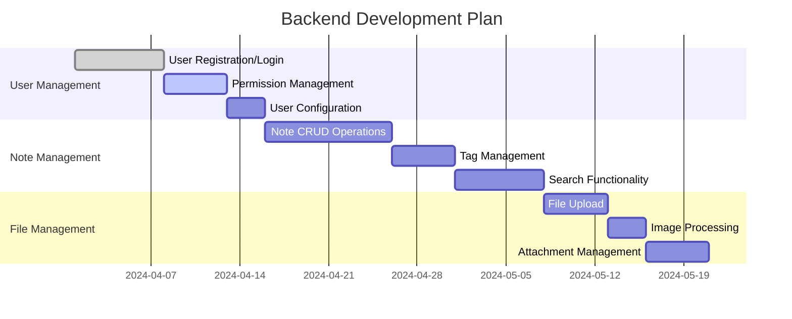

# Project Plan Example

This is an example of project planning and management documentation that demonstrates project planning, task allocation, and progress tracking.

## Project Overview

### Project Information
- **Project Name**: Intelligent Note Management System
- **Project Number**: PRJ-2024-001
- **Project Manager**: John Smith
- **Start Date**: 2024-01-15
- **Expected Completion**: 2024-06-30
- **Project Status**: In Progress

### Project Objectives
1. Develop a modern note management system
2. Support multiple note content formats
3. Provide powerful search and organization features
4. Implement cross-platform synchronization

## Project Team

### Core Team
| Role | Name | Responsibilities | Contact |
|------|------|------------------|---------|
| Project Manager | John Smith | Project coordination, progress management | john@company.com |
| Technical Lead | Mike Johnson | Technical architecture, code review | mike@company.com |
| Frontend Developer | Sarah Wilson | User interface development | sarah@company.com |
| Backend Developer | David Brown | Server-side development | david@company.com |
| Test Engineer | Lisa Davis | Quality assurance, testing | lisa@company.com |
| UI Designer | Tom Miller | Interface design, user experience | tom@company.com |

## Project Milestones

### Phase 1: Requirements Analysis (Jan 15 - Feb 15)
- [x] User requirements research
- [x] Functional requirements documentation
- [x] Technical feasibility analysis
- [x] Project plan development

### Phase 2: System Design (Feb 16 - Mar 31)
- [x] System architecture design
- [ ] Database design
- [ ] API interface design
- [ ] User interface design

### Phase 3: Development Implementation (Apr 1 - May 31)
- [ ] Backend service development
- [ ] Frontend interface development
- [ ] Database implementation
- [ ] Integration testing

### Phase 4: Testing and Deployment (Jun 1 - Jun 30)
- [ ] System testing
- [ ] Performance optimization
- [ ] User acceptance testing
- [ ] Production environment deployment

## Detailed Task Breakdown

### Backend Development Tasks


### Frontend Development Tasks
| Task | Assignee | Start Date | End Date | Status | Progress |
|------|----------|------------|----------|--------|----------|
| User Interface Design | Tom Miller | 2024-04-01 | 2024-04-15 | In Progress | 60% |
| Login/Register Pages | Sarah Wilson | 2024-04-16 | 2024-04-25 | Not Started | 0% |
| Note Editor Page | Sarah Wilson | 2024-04-26 | 2024-05-10 | Not Started | 0% |
| File Management Page | Sarah Wilson | 2024-05-11 | 2024-05-25 | Not Started | 0% |
| Search Function Page | Sarah Wilson | 2024-05-26 | 2024-06-05 | Not Started | 0% |

## Risk Assessment

### Technical Risks
| Risk | Probability | Impact | Mitigation |
|------|-------------|--------|------------|
| High learning cost for new technologies | Medium | High | Early training, technical research |
| Third-party service instability | Low | Medium | Backup solutions, service monitoring |
| Performance bottlenecks | Medium | Medium | Performance testing, optimization |

### Project Risks
| Risk | Probability | Impact | Mitigation |
|------|-------------|--------|------------|
| Frequent requirement changes | High | High | Requirement freeze, change control process |
| Staff turnover | Low | High | Knowledge documentation, cross-training |
| Schedule delays | Medium | Medium | Buffer time, parallel development |

## Resource Allocation

### Human Resources
- **Developers**: 4 people (80% time commitment)
- **Testers**: 1 person (60% time commitment)
- **Designers**: 1 person (50% time commitment)
- **Project Manager**: 1 person (30% time commitment)

### Technical Resources
- **Development Environment**: 4 cloud servers
- **Testing Environment**: 2 cloud servers
- **Database**: MySQL 8.0, Redis 6.0
- **Storage**: 100GB object storage
- **Monitoring**: Application performance monitoring tools

## Quality Assurance

### Code Quality
- Code review coverage: 100%
- Unit test coverage: >80%
- Integration test coverage: >90%
- Code standards compliance: ESLint + Prettier

### Testing Strategy
```javascript
// Test plan example
const testPlan = {
    unitTests: {
        coverage: '80%',
        tools: ['Jest', 'Mocha'],
        scope: 'All business logic'
    },
    integrationTests: {
        coverage: '90%',
        tools: ['Supertest', 'Cypress'],
        scope: 'API interfaces and user flows'
    },
    performanceTests: {
        tools: ['Artillery', 'JMeter'],
        metrics: ['Response time', 'Throughput', 'Concurrent users']
    }
};
```

## Communication Plan

### Meeting Schedule
- **Daily Standup**: Daily 9:00-9:15
- **Weekly Meeting**: Every Friday 14:00-15:00
- **Milestone Review**: At the end of each milestone
- **Project Review**: Last Friday of each month

### Communication Channels
- **Instant Communication**: Enterprise WeChat
- **Document Collaboration**: Tencent Docs
- **Code Management**: GitLab
- **Project Management**: Jira

## Summary

Project plan example demonstrates:
- Complete project structure and management process
- Detailed task breakdown and scheduling
- Risk assessment and mitigation measures
- Resource allocation and quality assurance strategies
- Effective communication and collaboration mechanisms 